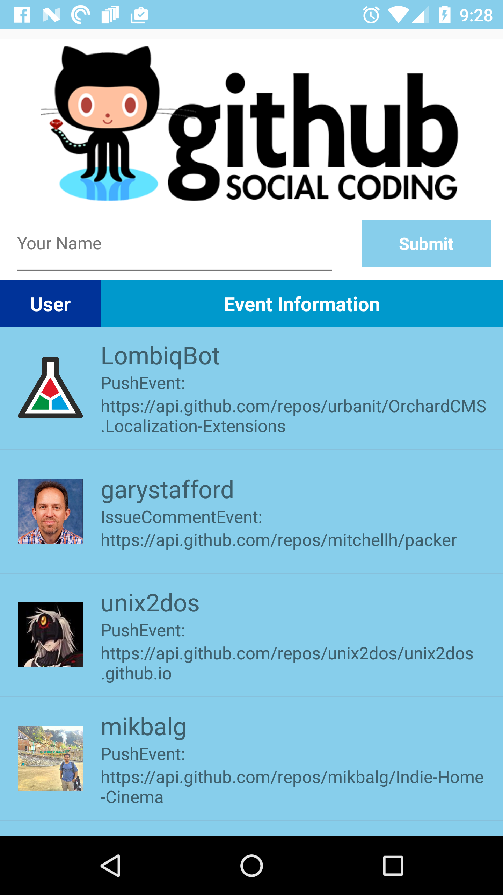

# React-Native-Github-User-Events
My first foray into the world of React Native. I really like it so far. You can choose how "native" you want your app to be for the most part. A lot more to learn, but RN has definitely reenergized me when it comes to software development. The name entry is just to demonstrate showing native dialogs. 

Some cool concepts learned during this journey:
+ Passing data/functions between components via State
+ Handling user input
+ Styles; So many cool things going on with Styles in the RN universe
+ Networking/handling JSON responses (A lot easier in js than doing it natively)
+ Components are modular (at least they should be if done right), Plug and play!

My current tools mainly include:
+ **Android Studio** for native Android code
+ **Xcode** for native iOS code
+ **Visual Studio Code** for JavaScript/JSX (I compared VS Code to Nuclide and Webstorm, VS Code wins)
+ **Iterm2** terminal
+ **Source Tree** for viewing diffs quickly, Staging hunks, quick commits

